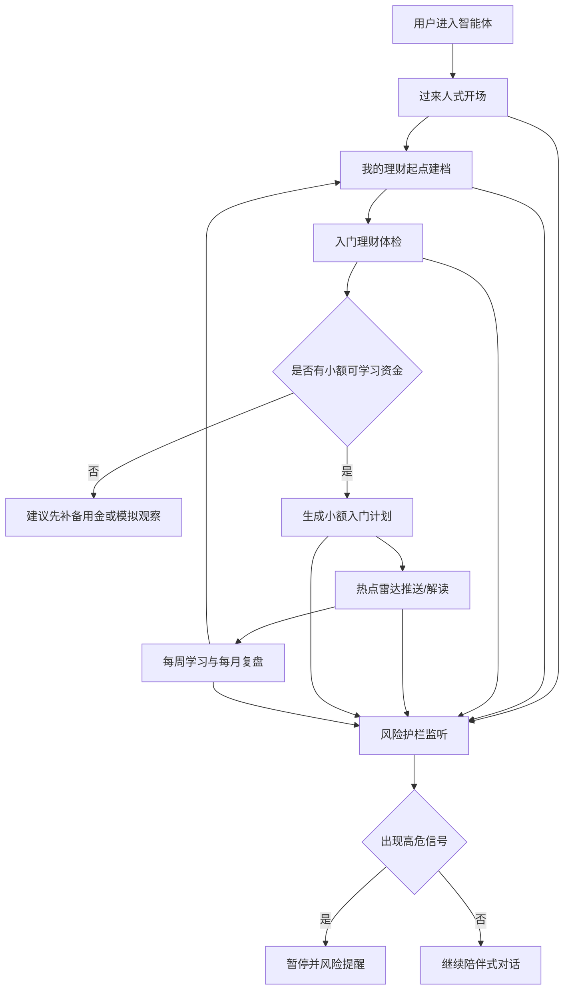
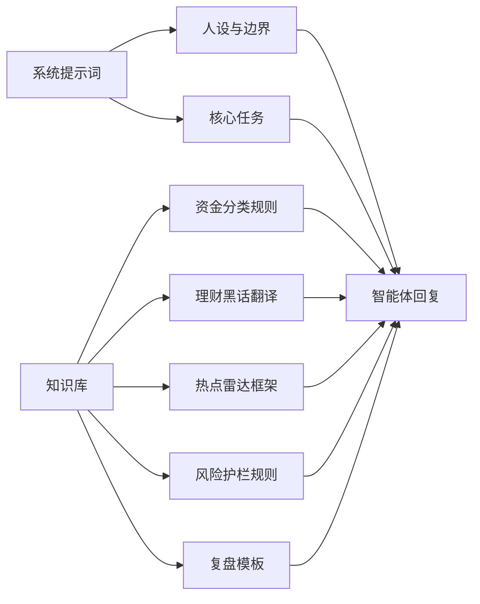

# 产品流程图

## 用户服务流程

```mermaid
flowchart TD
  A[用户进入智能体] --> B[过来人式开场]
  B --> C[我的理财起点建档]
  C --> D[入门理财体检]
  D --> E{是否有小额可学习资金}
  E -- 否 --> F[建议先补备用金或模拟观察]
  E -- 是 --> G[生成小额入门计划]
  G --> H[热点雷达推送/解读]
  H --> I[每周学习与每月复盘]
  I --> C
  B --> J[风险护栏监听]
  C --> J
  D --> J
  H --> J
  G --> J
  I --> J
  J --> K{出现高危信号}
  K -- 是 --> L[暂停并风险提醒]
  K -- 否 --> M[继续陪伴式对话]
```

## 智能体能力架构

```mermaid
flowchart LR
  A[系统提示词] --> B[人设与边界]
  A --> C[核心任务]
  D[知识库] --> E[资金分类规则]
  D --> F[理财黑话翻译]
  D --> G[热点雷达框架]
  D --> H[风险护栏规则]
  D --> I[复盘模板]
  B --> J[智能体回复]
  C --> J
  E --> J
  F --> J
  G --> J
  H --> J
  I --> J
```
